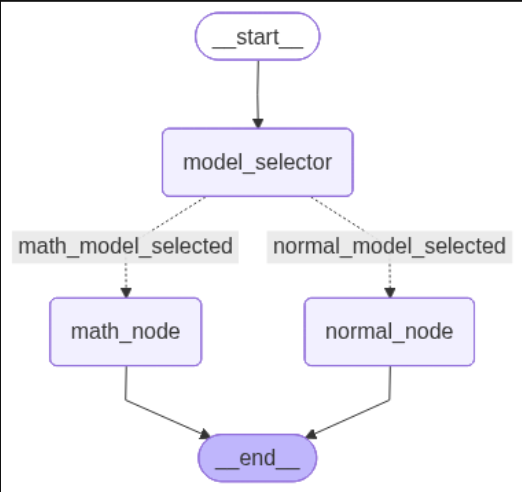

# LangGraph_ModelSwitch

A simple langGraph implementation for switching between small and reasoning models to reduce inference costs.

  

### Description
A simple langGraph agent that automatically switches between a small gpt-4.1-mini and O3 reasoning model based on user query. Ask a mathematical question to trigger the O3 model and ask a generic question to trigger the gpt-4.1-mini model. 

  

### Prerequisites
This is a simple repo and does not need many libraries. Installing Langgraph, langchain and jupyter lab should be enough.

### Running the notebook
The notebook has enough comments in place and is self explanatory. Remember to provide your API key when initializing the LLM models.
